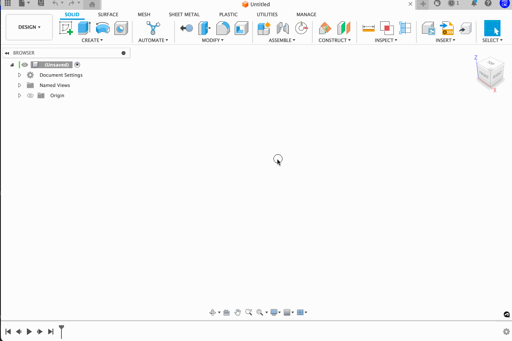

# Fusion 360 Batch File Importer

**This script makes for super quick and direct bulk file imports to Fusion 360.**

- Imports STEP and IGS files in bulk
- Creates a component for each file and names the component the file name.
- Reports the number of successful and failed imports via a message box

## How to Set Up the Batch File Importer Script

1. **Download the Script**: Clone or download this GitHub repo to get the script file.
2. **Fire Up Fusion 360**: Open Fusion 360 and go to `Tools > Add-ins`.
3. **Add Script**: In the `Scripts and Add-Ins` dialog, click the green `+` button or choose "Add Script".
4. **Find the File**: Navigate to the folder where you downloaded the script and select it. 
  - I'd suggest moving the file to a better location than say the Downloads folder.
5. **Run It**: After the script shows up in your add-ins list, hit the `Run` button.
6. **Check It**: You'll see a message box with the number of successful and failed imports.

### Note for Teams

- Stick the script in a shared folder so the whole team can easily access it.

---

## How to Run Script

1. Open Script:
  - Type `s` on keyboard to search, then "Script" to open Scripts and Add-ins.
  - Find Multi-Import-F360
2. Finder or Explorer Opens.
3. Select one or multiple STEP or IGES files and confirm.
4. Watch as the files import in no time without any uploading or processing needed.
5. Profit.

---
[pdxcnc.com](https://pdxcnc.com?ref=multi-import-github)