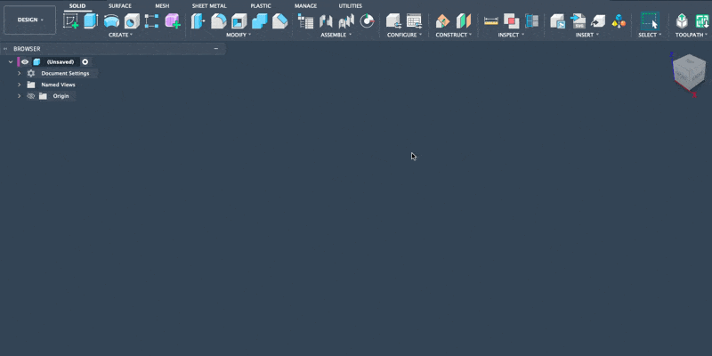
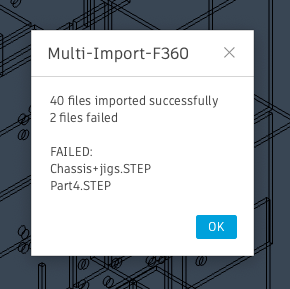
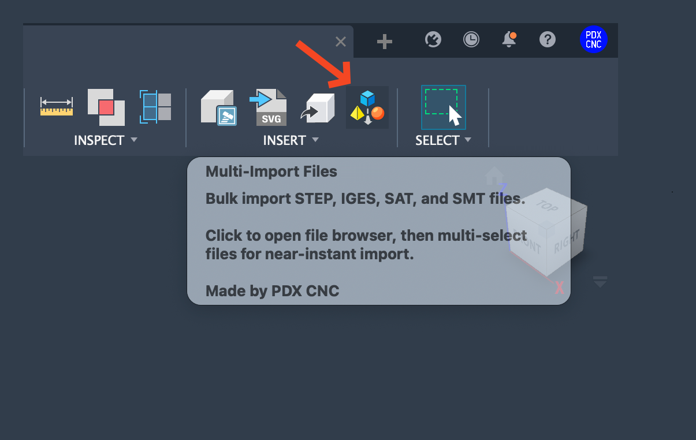

# Autodesk Fusion Batch File Importer v.2

**This add-in makes for ⚡ basically instant ⚡ direct bulk file imports to Fusion.**
- Bulk import of `STEP`, `IGES`, `SAT`, and `SMT` files
- Creates a **component** for each imported file, named after the file
- **Reports** successful and failed imports via message box
- Lists failed files for troubleshooting

### V0.2 – Now Add-in
> Among other things, this lets you create a keyboard shortcut

## Installation

1. **Download ZIP file**: Click the green "Code" button above and select **Download ZIP**
2. **Extract  ZIP**: Unzip the downloaded file to a location on your computer
3. **Open Fusion**: Go to `Tools > Add-ins`
4. **Add the Add-in**: Click the green `+` button, choose "Add Add-in"
5. **Select Folder**: Navigate to and select the `MultiImportF360` folder from the extracted ZIP
6. **Enable**: Check the box next to **Multi-Import F360** to enable it. Also check **Run at Startup**.
7. **Access Add-in**: The **Multi-Import Files** command will appear in:
   - Design/Tools toolbar
   - Design/Tools menu

### Team Installation

Extract the ZIP file and place the `MultiImportF360` folder in a shared location (Google Drive, Dropbox, etc.). Each team member needs to add the add-in from the shared location.

## How to Use

1. Click "Multi-Import Files" in the Tools toolbar, or go to `Tools > Multi-Import Files`
2. Select one or multiple supported files (STEP, IGES, SAT, or SMT) from the file picker
3. Files will import automatically
4. Review the message box for import results

---

### Tutorial Video

[Watch Video](https://www.youtube.com/watch?v=7SlQlq7Tulg)
> Shows previous script-based version. Same functionality just now an Add-in.
---

## Changelog

### v.2 (Current)
- Converted from script to Add-in
- Always available in Tools toolbar and menu
- Can create custom keyboard shortcuts
- Added support for SAT and SMT file formats
- New icon

### v.1
- Initial script-based version
- Supported STEP and IGES file formats only

---
🅿️ [pdxcnc.com](https://s.pdxcnc.com?ref=multi-import-github)

☕ [Buy me a coffee](http://buymeacoffee.com/pdxcnc)
